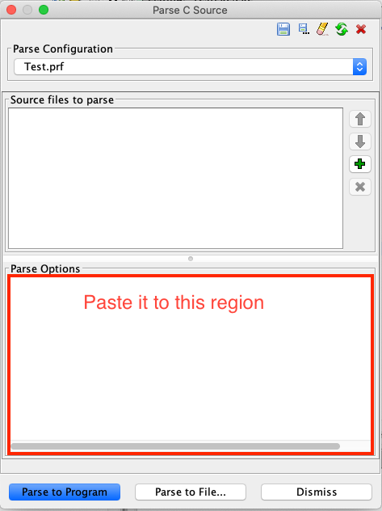

# Gdt helper

Ghidra has "Parse C Source" feature to add new struct or function types to "Data Type Manager."
Using this feature, we can add the types to "Data Type Manager" by writing C header file.

However, this is not easily performed as expected.
Without setting "Parse Configuration" propely, Ghidra cannot parse a relatively simple C header file.
Although several "Parse Configurations" are provided by default, this does not work properly :(.

Gdt helper solves this problem. It makes "Parse Cofigurations" for your envorinment.

# How to use

1. Make "Parse Options" and paste it.

```bash
# Specify a compiler as an input argument. clang/gcc/x86_64-mingw32-gcc/i686-mingw32-gcc are supported.
$ python gdt_helper.py make-parse-options clang
Please past the following output to "Parse Options"

-I/usr/local/include
-I/Applications/Xcode.app/Contents/Developer/Toolchains/XcodeDefault.xctoolchain/usr/lib/clang/11.0.0/include
-I/Applications/Xcode.app/Contents/Developer/Toolchains/XcodeDefault.xctoolchain/usr/include
-I/Applications/Xcode.app/Contents/Developer/Platforms/MacOSX.platform/Developer/SDKs/MacOSX.sdk/usr/include
-I/Applications/Xcode.app/Contents/Developer/Platforms/MacOSX.platform/Developer/SDKs/MacOSX.sdk/System/Library/Frameworks (framework directory)
-DCONST="const"
-D__restrict__=""
-D__always_inline__="inline"
-D__gnu_inline__="inline"
-D__builtin_va_list="void *"
-DOBJC_NEW_PROPERTIES="1"
-D_LP64="1"
-D__APPLE_CC__="6000"
-D__APPLE__="1"
...
```



2. Make a source file to parse and select this file as "Source files to parse." You can also specify additional include directories.

```bash
$ python gdt_helper.py make-file-to-parse clang example/osx/osx_system.h [Additional include directories]
```

3. Select "Parse to Program" (for importing data types to current project) or "Parse to File" (for creating gdt files)

# Supported

- Ubuntu 20.04
- macOS

# Special thanks

Inspired by https://github.com/0x6d696368/ghidra-data/blob/master/typeinfo/README.md.
